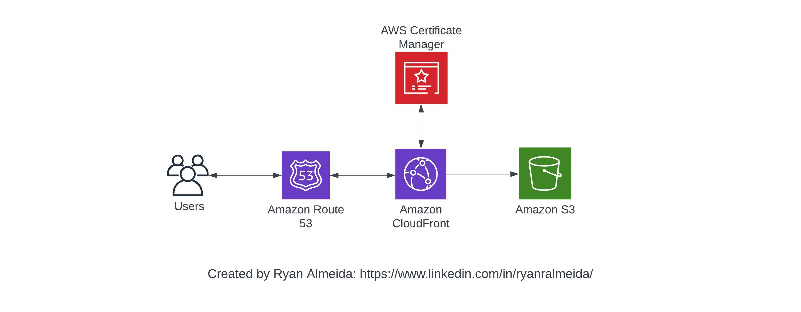

# Simple Resume Website Project

## An introductory Hands-On Project I worked on to develop practical skills in the cloud, by hosting my resume as a static wesbite, using AWS

This project was the first project I built on the cloud, alongside a tutorial series created by Rajdeep Saha (https://www.udemy.com/course/rocking-aws-for-beginners-hands-on/), which teaches you how to provision and configure basic resources in AWS such as an S3 bucket, CloudFront, Route 53 and AWS Certificate Manager. In particular, the steps used to create this project involve:

- Creating  an S3 bucket to host your resume
- Distributing the content to an edge location for improved latency and security
- Setting up a custom domain name using Route53 for better accessibility.

## Architecture and High Level Design

The website will be built using the following architecture: 

## Learning Outcomes

- This beginner friendly project has a low barrier to entry, providing you with hands-on experience in utilizing cloud infrastructure services, enabling you to understand the fundamental concepts of cloud computing and how various AWS services work together. 
- By setting up an S3 bucket to store your resume, you learn how to manage object storage and make it accessible over the web. 
- CloudFront, AWS’s content delivery network (CDN), helps you enhance the performance and availability of your resume by caching its content globally. 
- Additionally, configuring Route 53, AWS’s scalable DNS service, enables you to assign a custom domain name to your resume, making it easily accessible and professionally branded. 
- Overall, this beginner project allows you to grasp the basics of cloud hosting, storage, content delivery, and DNS management, building a solid foundation for further exploration of cloud technologies and services.

