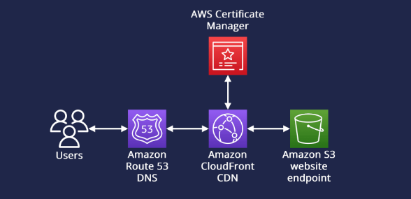

# Simple Resume Website Project

Visit my project here!: https://cloudwithryan.com/

This is an introductory Hands-On Project I worked on to develop practical skills in the cloud, using AWS. Feel free to read along and attempt it yourself. We will build a simple static website using beginner friendly and widely used services in AWS, such as S3, Cloudfront, and Route 53

## Architecture and High Level Design

The website will be built using the following architecture:   

## Learning Outcomes

This project helped me understand the following concepts:  
1) How to host a simple, static website on AWS using S3
2) How to increase security and availability by deploying it on CloudFront
3) How to make it more accesible through the web browser by using Route 53 and Amazon Certificate Manager (ACM)

## Setup
### 1. Upload HTML file into S3 Bucket 
